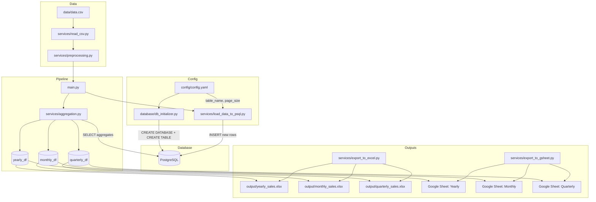

# CSV → PostgreSQL → Reports (Excel + Google Sheets)

Load a retail orders CSV into PostgreSQL, run SQL aggregations (yearly/monthly/quarterly sales), and export the results to Excel files and Google Sheets.

## File Structure

```
📁 config/ → App configuration (config.yaml)
📁 credentials/ → Google service account key (google_service_account.json)
📁 data/ → Input dataset (data.csv)
📁 database/ → PostgreSQL helpers + schema init
📁 helper/ → Utilities (utils.py)
📁 logs/ → Local logs (if any)
📁 output/ → Generated Excel exports
📁 services/ → Pipeline steps (load, aggregate, export)
📁 .vscode/ → VS Code workspace settings
📄 .env → Environment variables (local, not committed)
📄 main.py → Pipeline entrypoint (runs everything)
📄 test.py → Quick CSV sanity checks

```

---

## Project Graph



---

## Prerequisites

- Python 3.10+ (works with conda envs)
- PostgreSQL running locally or remotely
- Google service account JSON for Sheets export (optional)

## Configuration

### 1) `config/config.yaml`

```yaml
database:
  table_name: superstore_orders
  page_size: 500
```

### 2) `.env`

Create a `.env` file in the repo root with:

```bash
# Postgres
DB_HOST=localhost
DB_PORT=5432
DB_DATABASE=retail
DB_USER=postgres
DB_PASSWORD=your_password

# Used by db_initializer.py to create DB if missing
MAINTENENCE_DB=postgres

# Google Sheets (optional)
YEARLY_SHEET_ID=1Rh9-EwhKzAPHrqcszrGiF5OpcPwG9WUhB52XMC7D8j4
MONTHLY_SHEET_ID=1J7qWRM0mPyyYTzs37sZa8SX6T2-njvmkymi-ss2a3RA
QUARTERLY_SHEET_ID=1Mn79lbiXt3yU9aLTNbFYUfmkWmEaVNAU6tTJ0ry6ALA
```

## Setup

Install dependencies:

```bash
pip install -r requirements.txt
```

> If you already use a conda env, activate it first (e.g. `conda activate mlopsenv`).

## Initialize Database

This creates the database (if missing) and the table schema.

```bash
python database/db_initializer.py
```

## Run the Pipeline

```bash
python main.py
```

What it does:

1. Reads `data/data.csv`
2. Preprocesses (renames columns, parses dates, cleans nulls)
3. Inserts **only new rows** into PostgreSQL (by `row_id`)
4. Runs SQL aggregations (yearly/monthly/quarterly sales)
5. Exports to Excel in `output/`
6. Updates Google Sheets (if configured)

## Outputs

### Excel

- `output/yearly_sales.xlsx`
- `output/monthly_sales.xlsx`
- `output/quarterly_sales.xlsx`

### Google Sheets

These are the report sheets:

- Yearly: https://docs.google.com/spreadsheets/d/1Rh9-EwhKzAPHrqcszrGiF5OpcPwG9WUhB52XMC7D8j4/edit?usp=sharing
- Monthly: https://docs.google.com/spreadsheets/d/1J7qWRM0mPyyYTzs37sZa8SX6T2-njvmkymi-ss2a3RA/edit?usp=sharing
- Quarterly: https://docs.google.com/spreadsheets/d/1Mn79lbiXt3yU9aLTNbFYUfmkWmEaVNAU6tTJ0ry6ALA/edit?usp=sharing

Important for Google Sheets export:

- Place your service account JSON at `credentials/google_service_account.json`.
- Share the 3 Google Sheets above with the service account email (`client_email` inside the JSON) as **Editor**.

## Notes

- If your table name changes in `config/config.yaml`, update your schema by re-running `python database/db_initializer.py`.
- If you see `ModuleNotFoundError`, run scripts from the repo root (same folder as `main.py`).
